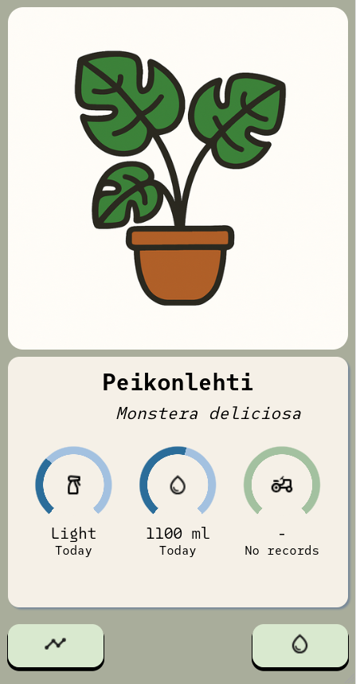
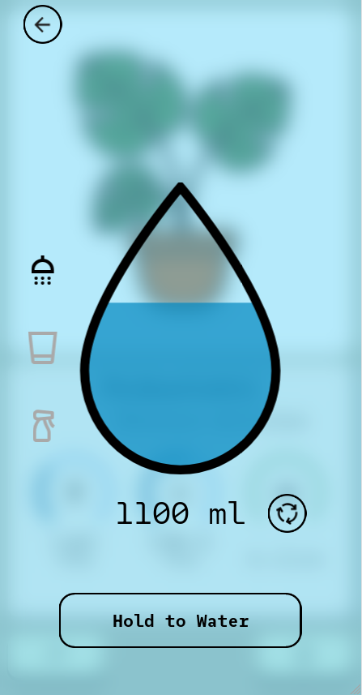
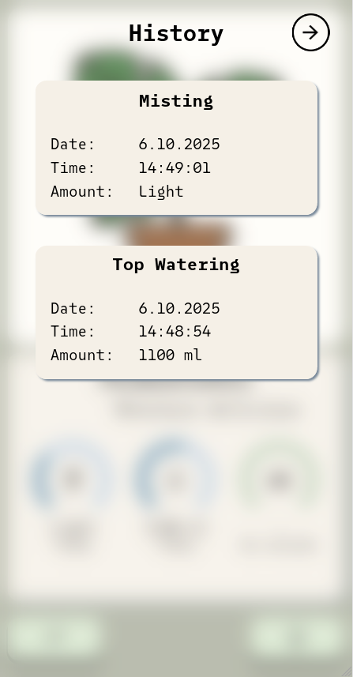

# PlantLog

Mobile web app for keeping track of houseplant waterings. Personal project, under construction.

## About

* Mobile-first design
* Touch-friendly UI
* Browser-based

## My setup
* **Server:** Node.js server running on a local, always-on Raspberry Pi. Data is stored in SQLite database.
* **Frontend:** Mobile-friendly web interface built with HTML, CSS, JavaScript and EJS  
* **Interaction:**
  - Each plant has a unique QR code attached to its pot. 
  - Scan the code with a smartphone to open the plant's page.
  - On the plant page, the user can view care data and log new waterings.

 ## Views

<table>
  <tr>
    <td></td>
    <td></td>
    <td></td>
  </tr>
</table>

